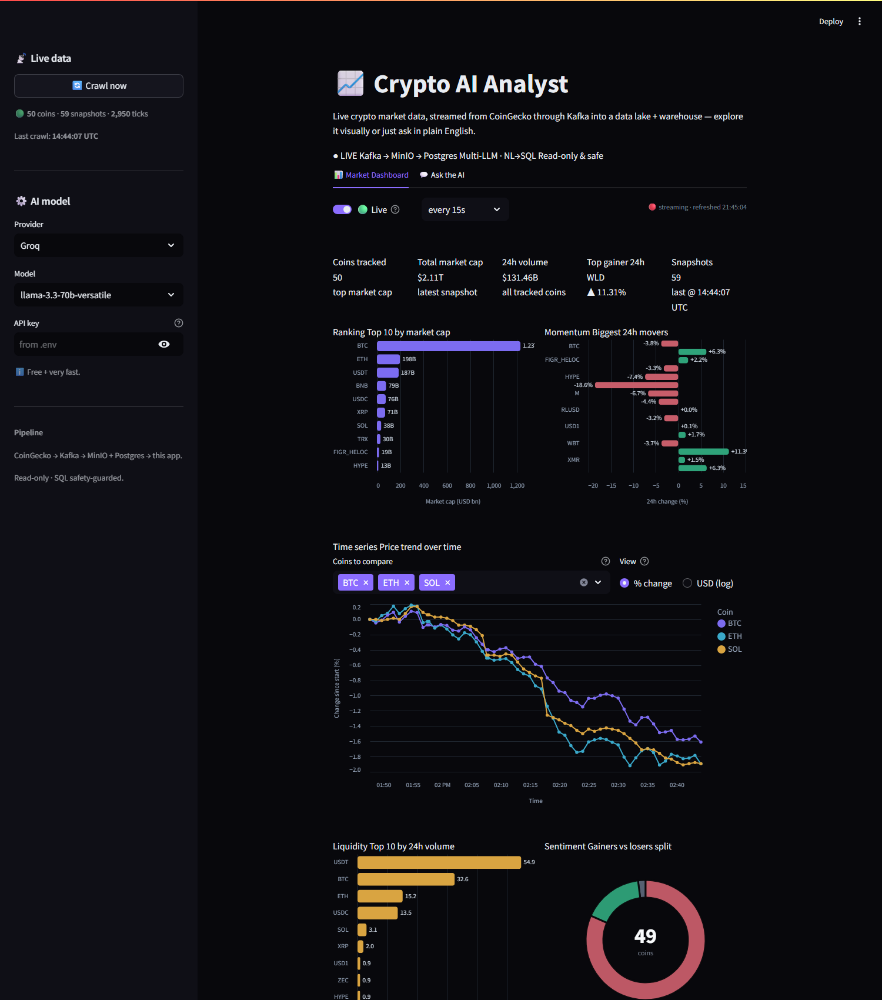
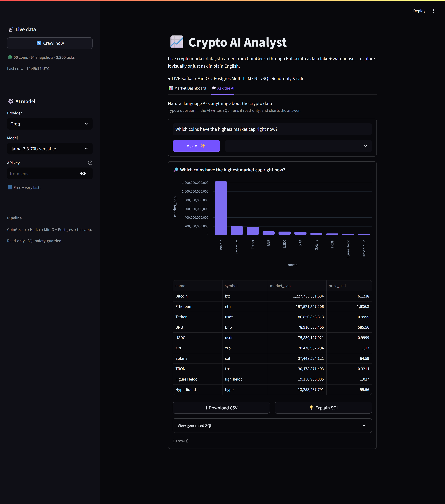

# AI Analytics Assistant

> **Natural language → SQL → results**, no data team bottleneck.
> Ask a question in plain English; the assistant generates SQL, runs it safely
> (read-only) against a PostgreSQL database of **live crypto market data streamed
> from the CoinGecko API**, and returns a chart-ready table.

### 📊 Realtime Market Dashboard

Auto-refreshing KPIs plus market-cap, 24h-movers, price-trend, volume and sentiment charts.



### 💬 Ask the AI (NL → SQL → chart)

Ask in plain English; the assistant writes SQL, runs it read-only, and returns a chart +
table with **Download CSV** / **Explain SQL** / **View generated SQL**.



---

## Highlights

- **Real-time streaming ingest** — a Kafka producer crawls CoinGecko (top-50 coins) and a
  consumer fans every tick out to **MinIO** (raw S3 data lake) and **PostgreSQL** (analytics
  warehouse). Both run 24/7 as Docker containers — no terminal to babysit.
- **Long-term raw lake** — MinIO keeps every tick as JSON (`ticks/dt=.../<coin>/<ts>.json`), so the
  warehouse can always be re-derived; the lake is the durable source of truth.
- **Multi-provider, switchable from the UI** — pick Groq / Gemini / OpenAI / DeepSeek / Ollama
  from a dropdown at runtime. Adding a new provider = one registry entry, no app changes.
- **Schema-aware prompting** — injects live table DDL + sample rows + time-series hints into the
  LLM context, so it knows "latest" means `captured_at = MAX(captured_at)`.
- **Query safety layer** — LLM output runs as a dedicated read-only DB role; a guard
  rejects anything that isn't a single `SELECT` (no `INSERT/UPDATE/DELETE/DDL`, no multi-statement).
- **Result auto-charting + Explain SQL** — time-series → line, ranking → bar; one click explains the
  generated SQL in plain language.

---

## Architecture

```
 CoinGecko API ─▶ Producer ─▶ Kafka(crypto.ticks) ─▶ Consumer ┬▶ MinIO (raw data lake)
                  [24/7]                              [24/7]   └▶ PostgreSQL (warehouse)
                                                                         │
┌──────────────┐   ┌──────────────────┐   ┌──────────────┐    read-only │   ┌──────────────┐
│ User         │──▶│ LLM Provider     │──▶│ Safety guard │──▶  execute ──┴──▶│ Result +     │
│ question (NL)│   │ (Groq/Gemini/..) │   │ read-only    │                   │ chart + SQL  │
└──────────────┘   └──────────────────┘   └──────────────┘                   └──────────────┘
        ▲                  │                                                        │
        │            schema context                                                │
        └──────────────────┴──────────────── 🤖 Streamlit AI Assistant ────────────┘
```

Producer + consumer run 24/7 as Docker containers; the assistant queries the warehouse.

---

## Tech stack

| Layer | Tech |
|---|---|
| Ingest source | CoinGecko public API (no key) |
| Streaming | Apache Kafka (KRaft, no Zookeeper) · `kafka-python-ng` |
| Data lake | MinIO (S3-compatible) · `boto3` |
| Warehouse | PostgreSQL 16 |
| LLM | Groq llama-3.3-70b (default, free) · Claude · Gemini · OpenAI · DeepSeek · Ollama |
| LLM client | `openai` SDK (OpenAI-compatible) + `anthropic` SDK (Claude) + `requests` (Ollama) |
| Safety | `sqlparse` statement guard + read-only DB role |
| UI | Streamlit + Altair |
| Infra | Docker Compose (one command brings up the whole stack) |

---

## Project structure

```
03-AI-Analytics-Assistant/
├── .env.example              ← env template (DB + LLM + Kafka + MinIO)
├── requirements.txt
├── app.py                    ← Streamlit root entrypoint
├── docker/
│   ├── docker-compose.yml    ← Postgres + Kafka + MinIO + producer/consumer
│   └── Dockerfile            ← image for the ingest workers
├── sql/
│   ├── 01_schema.sql         ← coins + price_ticks (crypto time series)
│   └── 02_readonly_role.sql  ← read-only role for LLM queries
├── src/
│   ├── config.py             ← env loading, provider registry, stream config
│   ├── streaming/            ← producer + consumer + MinIO lake writer
│   ├── crawler/              ← CoinGecko client + DB writer (used by producer)
│   ├── db/                   ← connection + schema introspection
│   ├── llm/                  ← provider base + factory + implementations
│   ├── safety/               ← SQL guard + read-only executor
│   ├── pipeline.py           ← NL → SQL → result glue
│   └── app/                  ← Streamlit app
└── tests/                    ← guard + streaming tests
```

---

## How to run

### The one-command way (recommended)

```bash
cp .env.example .env          # fill in password + paste a free Groq key into GROQ_API_KEY
cd docker
docker compose up -d --build  # Postgres + Kafka + MinIO + 24/7 producer/consumer
cd ..
pip install -r requirements.txt
streamlit run app.py          # open http://localhost:8501
```

That's it — the producer/consumer containers start crawling immediately and keep
the warehouse + data lake fed. Ask a question in the UI:

- *"Top 10 coins by current price"*
- *"Which 5 coins gained the most in the last 24 hours?"*
- *"Price history of bitcoin over time"*

> Free Groq key: https://console.groq.com/keys (default provider). Gemini/OpenAI/DeepSeek/Ollama
> also work — pick from the sidebar.
> Run `streamlit run app.py` (root entrypoint), **not** `src/app/main.py`, so `import src.*` resolves.

### Running each piece by hand

```bash
python -m src.streaming.producer --once    # crawl CoinGecko → Kafka
python -m src.streaming.consumer --drain    # Kafka → MinIO + Postgres, then exit
streamlit run app.py                        # the AI Assistant UI
```

### Service endpoints

| Service | URL | Login |
|---|---|---|
| AI Assistant | http://localhost:8501 | — |
| Kafka UI | http://localhost:8082 | — |
| MinIO Console | http://localhost:9001 | `MINIO_ACCESS_KEY` / `MINIO_SECRET_KEY` (see `.env`) |
| PostgreSQL | localhost:5433 | `DB_USER` / `DB_PASSWORD` (see `.env`) |

---

## Switching LLM providers

The sidebar exposes **Provider** + **Model** dropdowns. The list is driven by
`PROVIDER_REGISTRY` in [src/config.py](src/config.py) — to add a provider you add one
registry entry (and, only if it isn't OpenAI-compatible, one small class under `src/llm/`).
No changes to the app or the pipeline are required.

---

## Status

Streaming ingest (Kafka + MinIO + Postgres) + NL2SQL assistant + charting/explain — complete.
```bash
python -m pytest tests/ -q     # 23 tests (safety guard + streaming serialization)
```
